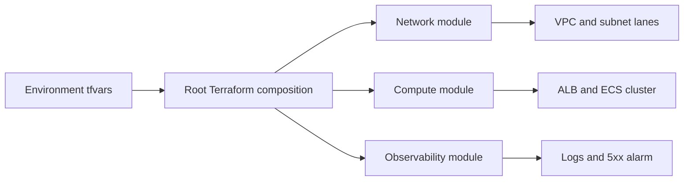

# Platform Foundation Blueprint

Platform Foundation Blueprint is a Terraform infrastructure design for a policy-aware, multi-environment platform baseline. It frames networking, ingress, compute, and observability as one cohesive foundation instead of isolated cloud resources.

## Portfolio Takeaway

- Terraform-first infrastructure blueprint with environment overlays
- network, compute, and observability split into readable modules
- platform story that fits control rooms, governance, and reliability systems already in the portfolio
- real documentation and proof assets instead of a bare `main.tf`

## Overview

| Area | Details |
| --- | --- |
| IaC | Terraform |
| Cloud | AWS-oriented module structure |
| Focus | Multi-environment networking, ALB ingress, ECS-style compute, and observability alarms |
| Modules | `network`, `compute`, `observability` |
| Environments | `dev`, `prod` |
| Runtime Shape | Blueprint and module layout ready for `terraform init/plan` once Terraform is installed |

## What It Does

- establishes a VPC with public and private subnet lanes
- creates a load-balanced compute entry point
- wires a log group and 5xx alarm for operational visibility
- keeps env-specific settings in dedicated `tfvars` overlays

## Architecture



Additional detail lives in [C:\Users\chaus\dev\repos\platform-foundation-blueprint\docs\architecture.md](/C:/Users/chaus/dev/repos/platform-foundation-blueprint/docs/architecture.md).

## Module Layout

- `modules/network`
- `modules/compute`
- `modules/observability`
- `environments/dev.tfvars`
- `environments/prod.tfvars`

## Example Plan Flow

```powershell
Set-Location "C:\Users\chaus\dev\repos\platform-foundation-blueprint"
terraform init
terraform plan -var-file="environments/dev.tfvars"
```

## Screenshots

### Hero


### Module Lanes


### Environment Overlay


### Validation Proof


## Local Run

Terraform is not installed in this environment yet, so this repo is currently delivered as a ready-to-plan blueprint. Once Terraform is available:

```powershell
Set-Location "C:\Users\chaus\dev\repos\platform-foundation-blueprint"
terraform init
terraform plan -var-file="environments/dev.tfvars"
```

## Tech Stack

[](https://developer.hashicorp.com/terraform)
[](https://aws.amazon.com/)

## Portfolio Links

- [Kinetic Gain](https://kineticgain.com/)
- [LinkedIn](https://www.linkedin.com/in/mirzacausevic)
- [GitHub](https://github.com/mizcausevic-dev)
- [Skills Page](https://mizcausevic.com/skills/)
